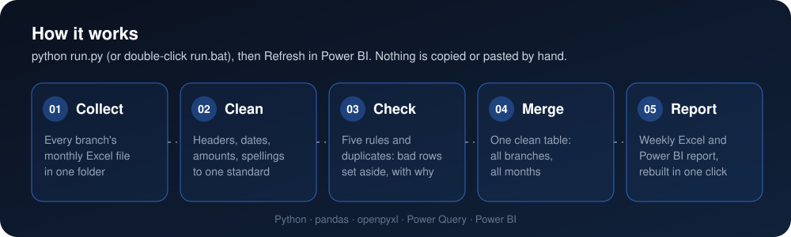
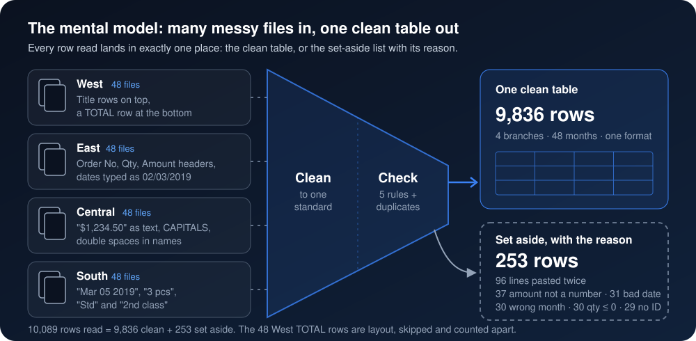
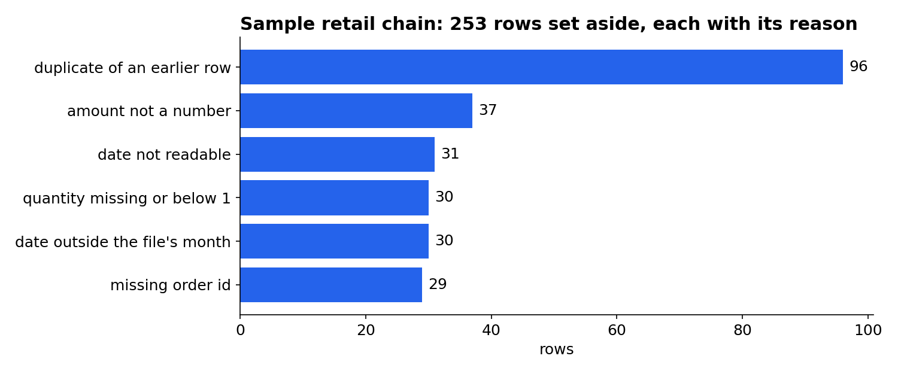
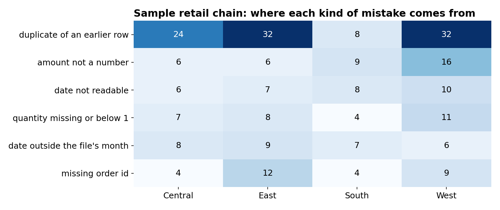
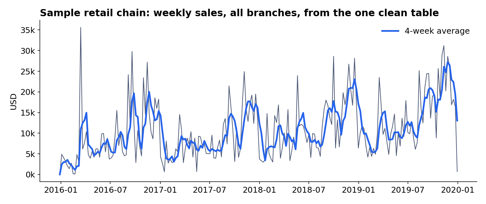
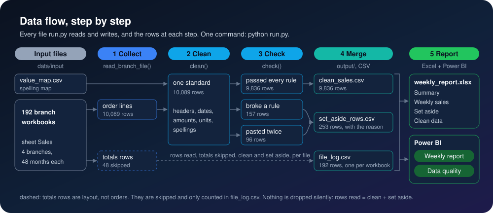
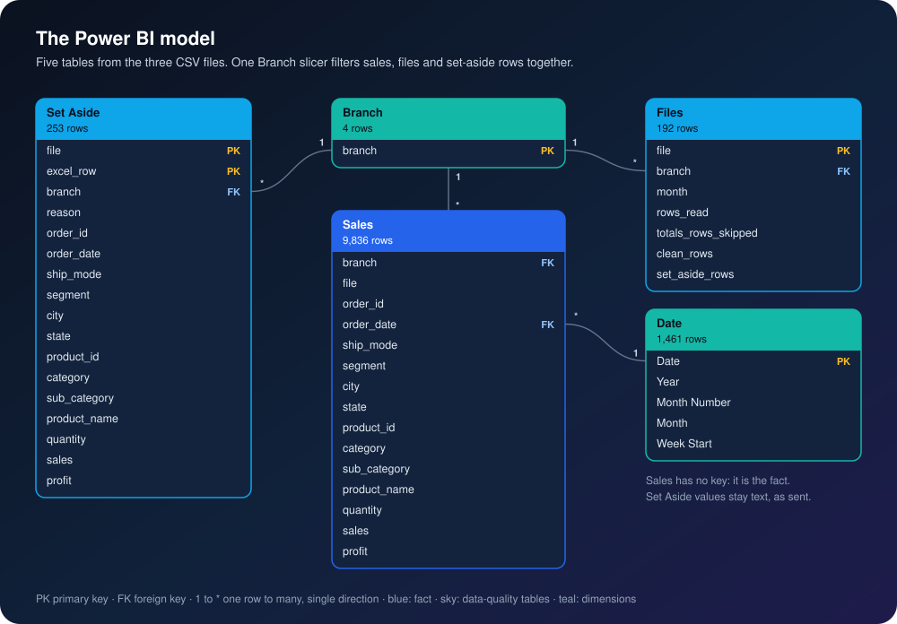

<p align="center">
  
</p>

<p align="center">
  
</p>

<p align="center">
  
  
  
  
</p>

<h3 align="center">192 branch Excel files merged into one weekly report in one click:<br>10,089 rows read, 253 errors caught and set aside with the reason.</h3>

## The problem

Every branch sends its own monthly Excel file in its own format. One puts a title block on top and a totals row at the bottom. One names its columns differently and types dates as text. One sends amounts as "$1,234.50" and categories in capitals. One writes "3 pcs" and "2nd class". So each week someone opens every file, copies, fixes and pastes before anyone sees a total, and the mistakes inside the files (a missing order ID, a date from next month, a line pasted twice) slip into the numbers without anyone noticing.

## 🛠️ The solution

<p align="center">
  
</p>

<p align="center">
  
</p>

One script, [`run.py`](run.py), does the week's work:

1. **Collect:** reads every file in `data/input/`, finds the header row wherever it sits, and skips the title rows and the totals row.
2. **Clean:** maps every branch's headers to one set of names, reads each branch's own date format (never guessed), turns "$1,234.50" and "3 pcs" into numbers, and fixes capitals, extra spaces and spellings from one mapping file.
3. **Check:** five rules (missing order ID, date not readable, date outside the file's month, quantity missing or below 1, amount not a number), then duplicates. A row that fails is set aside with its reason, its file and Excel row number, and its values exactly as the branch sent them, so it can be fixed at the source.
4. **Merge:** one clean table across all branches and months.
5. **Report:** `output/weekly_report.xlsx` (Summary, Weekly sales, Set aside, Clean data sheets) and three CSV files that the Power BI report refreshes from.

## 📈 The result

<p align="center">
  
</p>

| Measure | Result |
|---|---|
| Branch files merged | 192 (4 branches, 48 months each) |
| Rows read | 10,089 |
| Clean rows | 9,836 |
| Errors caught | 253: 157 rows that break a rule and 96 lines pasted twice (2.5% of rows) |
| Report rebuilt in | under a minute, with one command |

- **Nothing is dropped silently:** 10,089 rows read = 9,836 clean + 253 set aside. The 48 totals rows are layout, not orders, and are counted apart.
- **Tested against a known answer:** the mistakes were planted on purpose and listed in [`data/input/planted_errors.csv`](data/input/planted_errors.csv). All 253 were caught at the right file, row and reason, and nothing else was set aside. Every clean row matches its source line exactly.
- **It found a real problem too:** 225 order lines (47 products) in the source carry hidden non-breaking spaces in the product name, the kind that makes a VLOOKUP fail. The cleaner turns them into normal spaces.







Every number here comes from [`analysis/analysis.ipynb`](analysis/analysis.ipynb), which runs the pipeline, checks the result three ways (planted mistakes, source lines, SQL) and draws the charts.

## 📊 Power BI report

[`powerbi/`](powerbi/) builds a two-page report in Power BI Desktop step by step, ready to copy and paste: the Power Query code, the model, 14 DAX measures, every visual with its fields, the theme, and the numbers each page must show.

- **Weekly report:** sales, profit, margin, orders and average order value; weekly sales by branch; monthly sales by branch; sales and profit by category.
- **Data quality:** files, rows read, clean rows, errors caught and error rate; rows set aside by reason and by branch; the list of rows to fix at the source.

## ▶️ Run it

<p align="center">
  
</p>

```bash
pip install -r requirements.txt
python run.py
```

On Windows you can double-click `run.bat` instead. Then open `analysis/analysis.ipynb` and run all cells to recompute every number and chart. The branch files are already in the repo; `python data/demo/make_branch_files.py` makes them again from the source.

Everything that changes per client is in `config/client.yaml` and `data/input/`.

```
run.py                   the one click: read, clean, check, merge, report
run.bat                  the same, as a double-click on Windows
config/client.yaml       every client value: file names, columns, date formats, the rule, colours
config.py                load_config(), the only reader of client values
theme.py                 writes powerbi/05-theme.json from the client's colours
data/input/              the branch files, the spelling map and the demo's answer key (columns: README there)
data/demo/               demo only: the source orders and the script that made the branch files
output/                  clean_sales.csv, set_aside_rows.csv, file_log.csv, weekly_report.xlsx
analysis/analysis.ipynb  every number in this README, with the checks
powerbi/                 the Power BI report, step by step
docs/                    the diagrams and charts in this README
```

## 🏗️ For engineers

Every file `run.py` reads and writes, and the rows at each step:



The five tables the Power BI report builds from the three CSV files:



## 🗂️ Data

Tableau's Sample Superstore orders: 9,994 US order lines from 2016 to 2019, in `data/demo/`. `data/demo/make_branch_files.py` splits them into one file per region (West, East, Central, South) and month, gives each region its own template, and plants mistakes on purpose with a fixed random seed. One line that the source repeats exactly was removed first, so the only duplicates are the planted ones.

---

Built by [Omar Shalaby](https://github.com/omarshalabyy1) · Python, pandas, Excel, Power BI

<p align="center">
  
</p>
